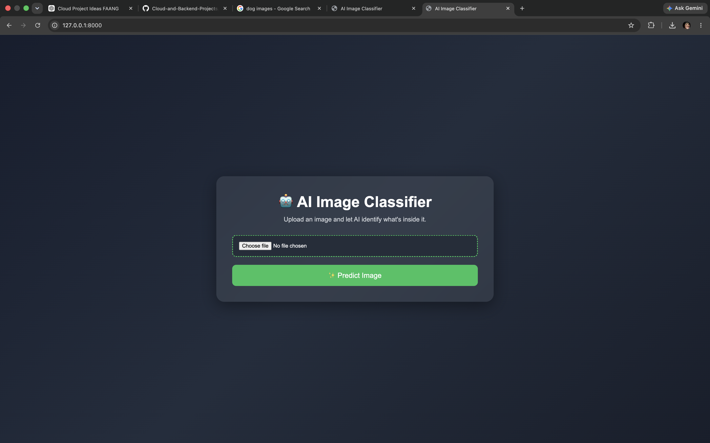
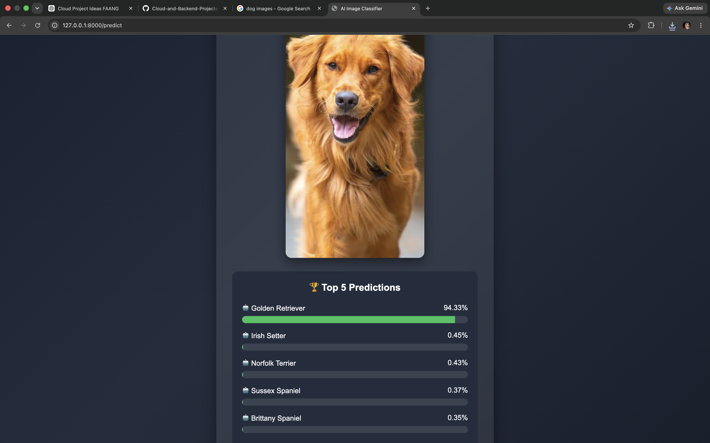

# 🤖 AI Image Classifier using FastAPI & TensorFlow

A cloud-ready AI image classification web application built using **FastAPI**, **TensorFlow**, and **MobileNetV2**.

Users can upload an image through a modern web interface, and the application predicts the **Top 5 ImageNet classes** along with confidence scores.

---

# 📸 Demo

## 🏠 Home Page



---

## 🔍 Prediction Result



---

# 🚀 Features

- Upload any image
- AI-powered image classification
- Top 5 ImageNet predictions
- Confidence percentage bars
- Modern responsive UI
- FastAPI backend
- TensorFlow MobileNetV2 model
- Clean project structure

---

# 🛠 Tech Stack

- Python
- FastAPI
- TensorFlow
- MobileNetV2
- HTML
- CSS
- Jinja2 Templates
- Uvicorn

---

# 📂 Project Structure

```
01-Cloud-Image-Processing-Pipeline
│
├── app
│   ├── main.py
│   ├── model.py
│   ├── routes.py
│   └── services.py
│
├── templates
│   └── index.html
│
├── uploads
│
├── assets
│   ├── home-page.png
│   └── prediction-result.png
│
├── requirements.txt
├── README.md
└── .gitignore
```

---

# ⚙️ Installation

Clone the repository

```bash
git clone https://github.com/RoshanR-tech/Cloud-and-Backend-Projects.git
```

Go to the project folder

```bash
cd Cloud-and-Backend-Projects/01-Cloud-Image-Processing-Pipeline
```

Create a virtual environment

```bash
python -m venv venv
```

Activate it

### macOS / Linux

```bash
source venv/bin/activate
```

### Windows

```bash
venv\Scripts\activate
```

Install dependencies

```bash
pip install -r requirements.txt
```

---

# ▶️ Run the Application

```bash
uvicorn app.main:app --reload
```

Open your browser

```
http://127.0.0.1:8000
```

---

# 🧠 How It Works

1. User uploads an image.
2. FastAPI receives the image.
3. TensorFlow preprocesses it.
4. MobileNetV2 predicts ImageNet classes.
5. The Top 5 predictions are displayed with confidence percentages.
6. The uploaded image is shown alongside the prediction results.

---

# 📌 Example Prediction

| Rank | Prediction | Confidence |
|------|------------|-----------:|
| 1 | Golden Retriever | 94.33% |
| 2 | Irish Setter | 0.45% |
| 3 | Norfolk Terrier | 0.43% |
| 4 | Sussex Spaniel | 0.37% |
| 5 | Brittany Spaniel | 0.35% |

---

# 🌟 Future Improvements

- Docker support
- AWS EC2 deployment
- Amazon S3 image storage
- User authentication
- Image history
- REST API documentation
- Multiple AI models
- Batch image predictions
- Kubernetes deployment

---

# 🎯 Learning Objectives

This project helped me learn:

- FastAPI fundamentals
- Backend API development
- TensorFlow model integration
- Image preprocessing
- Jinja2 templating
- File uploads
- Project organization
- Git & GitHub workflow

---

# 📜 License

This project is open source and available under the MIT License.

---

## 👨‍💻 Author

**Roshan R**

GitHub: https://github.com/RoshanR-tech

---

⭐ If you found this project helpful, consider giving it a star!
