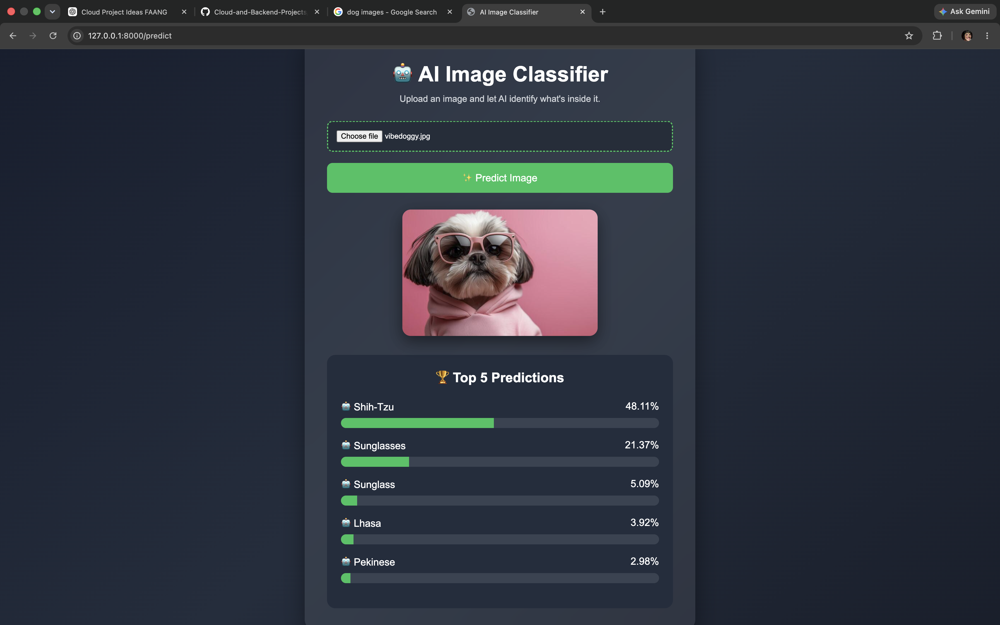

# 🤖 AI Image Classifier using FastAPI & TensorFlow

A cloud-ready AI image classification web application built using **FastAPI**, **TensorFlow**, and **MobileNetV2**.

Users can upload an image through a modern web interface, and the application predicts the **Top 5 ImageNet classes** along with confidence scores.

---

# 📸 Demo

## 🏠 Home Page


---

## 🔍 Prediction Result



---

# 🚀 Features

- Upload any image
- AI-powered image classification
- Top 5 ImageNet predictions
- Confidence percentage bars
- Modern responsive UI
- FastAPI backend
- TensorFlow MobileNetV2
- Clean project structure

---

# 🛠 Tech Stack

- Python
- FastAPI
- TensorFlow
- MobileNetV2
- HTML
- CSS
- Jinja2

---

# 📁 Project Structure

```text
01-Cloud-Image-Processing-Pipeline/
│
├── app/
│   ├── main.py
│   ├── model.py
│   ├── routes.py
│   └── services.py
│
├── templates/
│   └── index.html
│
├── assets/
│   ├── home-page.png
│   └── prediction-result1.png
│
├── uploads/
├── requirements.txt
└── README.md
```

---

# ▶️ Installation

```bash
git clone https://github.com/RoshanR-tech/Cloud-and-Backend-Projects.git

cd Cloud-and-Backend-Projects/01-Cloud-Image-Processing-Pipeline

pip install -r requirements.txt

uvicorn app.main:app --reload
```

Open:

```
http://127.0.0.1:8000
```

---

# 🎯 Future Improvements

- Drag & Drop image upload
- Docker support
- AWS deployment
- REST API documentation
- User authentication
- Image upload history

---

## 👨‍💻 Author

**Roshan R**

GitHub: https://github.com/RoshanR-tech
